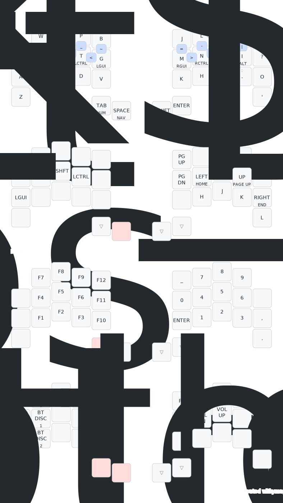

# ZMK wireless firmware / config
Configured for the A. Dux split keyboards with a nice!nano v2 compatible controller.

# Notes (mainly to self)

- 3 layers:
    - **NAV**: Navigation layer
    - **NUM**: Numbers layer
    - **FUN**: Functional layer (and things like profile switching)

- One shot shift key
- Heavy use of combos for all symbols and common keys

# Keymap

> Generated by [Keymap Drawer](https://keymap-drawer.streamlit.app/)

</img>
